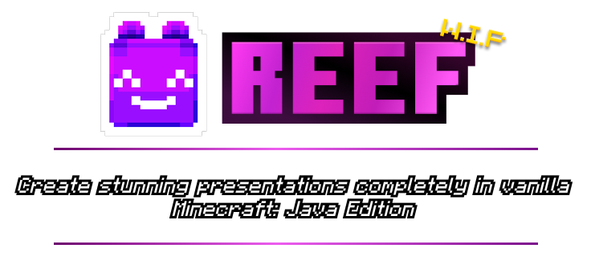

Reef is a slideshow / slide deck / presentation library that provides tools to make, and present slideshows in-game in Minecraft: Java Edition.

---

> [!WARNING]
> This is currently **work in progress!** Be cautious when using this library in its unfinished state as it may break your world!

## Features *(to implement)*
- Data-driven slideshow definitions
  * Includes: data-driven pages, elements, transitions
- Items:
  * Remote - controls the screen it is linked to
- *...and more coming soon!*

## Credits
- Author - @trplnr
- Co-author - @rx97
### Thanks to:
- Smithed Summit team for reaching out to make this project and being the inspiration for this project.
- People who helped me test:
  * @rx97
  * @hablethedev on Discord
  * @stoupy on Discord